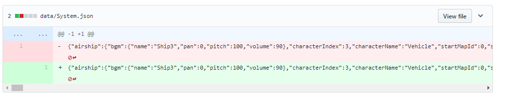

# Create pretty JSON using git hooks for better diffs

## Background

Git is a powerful Version Control System that keeps track of differences in files as well as facilitating collaboration between team members. This isn't a git tutorial, but a tutorial to address an annoyance that people face when using git to work collaboratively on an RPG Maker MV project.

Several of the data files in RPG Maker don't save in a nice, pretty format (`System.json` is one in particular).

This causes the git diffs to become cluttered with useless information since all of the text will be on one line, so you can't tell what was actually changed. In addition, the diffs themselves can become large (in terms of bytes).



Pre-requisites:

* Git is installed on your computer
* NodeJS is installed on your computer
  * If you're on Windows, install it from the official NodeJS website
  * If you're on Mac, install it with Homebrew. It's so much easier than the official downloadable and it sets the appropriate permissions on your directories


## How to do it

We're going to use a built-in feature of git called "git hooks". There are a variety of hooks available, the one we are going to use is a "pre-commit" hook. This hook runs before the commit action happens.

The hook can execute in basically any language, the default is shell or bash but it's very common to use ruby and python. In this example, we're going to use Javascript.

In order to make use of the pre-commit hook, we need to do the following things:

1. Identify the JSON files that we want to pretty
2. Read the file into memory as a string
3. Parse the string into a Javascript object
4. Stringify the object back into a string, but with nice line breaks and spacing
5. Write that string back to the file
6. Add the file to git tracking again (since it has changed from the hook)
7. Exit with code 0 if successful, exit with code 1 and print the error if not successful


## The code

```
#!/usr/bin/env node

const files = ['data/System.json']   // add all JSON files here to pretty
const fs = require('fs')
const { exec } = require('child_process')
try {
    files.forEach(file => {
        // Load file, pretty the JSON, and write it back
        const json = fs.readFileSync(`./${file}`)
        fs.writeFileSync(`./${file}`, JSON.stringify(JSON.parse(json), null, 2))
        // Add the file back to the staging since it changed
        exec(`git add ${file}`, (err, stdout, stderr) => {
            if (err) {
                console.error(err)
                process.exit(1)
            }

            console.log(`stdout: ${stdout}`)
            console.log(`stderr: ${stderr}`)
            process.exit(0)
        })
    })

} catch (err) {
    console.error(err)
    process.exit(1)
}
```
## Conclusion

Save the code above inside your ".git/hooks" folder in your project directory as "pre-commit". So the full path to that file is ".git/hooks/pre-commit" (note: there's no file extension, it's not "pre-commit.js" it's just "pre-commit")

Now this script will run every time files are committed, which will convert the JSON to pretty JSON with spacing and line breaks, so that the differences can be seen in git.