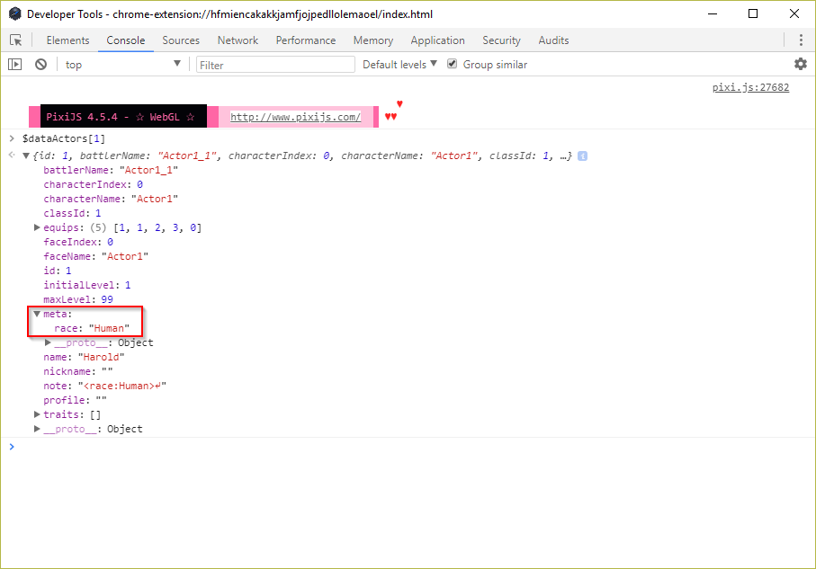

# Write a Plugin that reads Notetags - Beginner

## What should you know before getting started?

This is a beginner level tutorial, and almost everything will be explained in detail. That being said, it would help to have a basic understanding of the following concepts:

* What a Javascript variable is
* The sections of the database (Actor, Item, etc.)
* The difference between assigning a value to a variable vs. checking for equality in a variable
  * i.e. `var myVar = 3` vs. `myVar === 3`
* How to create folders and files on your computer

---
## What will you learn?

You will learn how to:
* Read basic notetag data
* Alias a function
* Create a new property on an actor
* Write a script call that can be used in events
* Create a plugin command
* Slightly alter the Status Menu

---
## Let's get started!

---

### RPG Maker MV version

This tutorial is written using modern Javascript standards (ES2015+) that are available in MV v1.6+. For old versions of MV, be sure to use the old Javascript code that is provided. Look out for the sections labelled {{Old MV}}.\
If only one version of code is provided, it will work with any version.

### Setup

This tutorial is best followed on a **blank** project with *no plugins installed*.\
If your code isn't working, you will know it is a mistake that you made rather than an incompatibility with another scripter's code. After you have tested your plugin in a blank project, then you can integrate it with existing projects.\
In order to write the code, you will need a text editor. Some recommendations are Notepad++, Visual Studio Code, Sublime Text, Atom, Brackets.\
Start by creating a blank Javascript file (.js file) named whatever you would like.

---
## Tutorial

This tutorial will teach you how to read an actor's "race" (like Human, Goblin, Dwarf) from their notetag in the database, and display it in the Status Menu.

1. Add the following text to Harold's notetag in the database:
    * `<race:Human>`
---
2. Run the game in test mode. On the Title screen, press F8 to open the console, and we will discover the 'meta' property that is on all database objects. In the console, type the following and press enter:
    * `$dataActors[1]`

Expand the data using the arrows, and you will see all of the data from the Database entry for Harold, including the "race" notetag you have added.



*How did this get there?*

The RPG Maker MV developers added this `meta` property to make it easy to read notetag data.

---

3. Begin writing the plugin, specifically, the section to read the notetag data. In your .js file, write the following:

```javascript
// Retain a reference to the original function
const Game_Actor_setup = Game_Actor.prototype.setup;
```

{{Old MV: Replace `const` with `var`}}

This creates an alias of the existing `setup` function for actors. In Javascript, you can completely overwrite functions; so by doing this, we will keep a reference to the original function.\

---
4. Below that, we will define our new actor `setup` function.

```javascript
Game_Actor.prototype.setup = function (actorId) {
  // Call the original function
  Game_Actor_setup.call(this, actorId);
};
```

We call the original function so that the normal setup of the actors still happens.

---
5. Now we can add one more line to our `setup` function to read from the `meta` data that we examined in step 2.

```javascript
Game_Actor.prototype.setup = function (actorId) {
  // Call the original function
  Game_Actor_setup.call(this, actorId);
  this.race = $dataActors[actorId].meta.race || null;
};
```

The actor now has a `_race` property on it that is set to whatever was written in the notetag!

Let's stop for a quick Q & A about this.

---
### Q & A - Round 1
> Why did we go through the trouble of aliasing and calling the original function? Why not just copy the whole function from `rpg_objects.js` and add our line to the end?

We could have, and this would have produced an identical result.

However, by overwriting the `setup` function without keeping a reference to the original, we would have made our plugin incompatible with any other plugins that use the same `setup` function.

> What is the difference between 'Game' Actor and 'Data' Actor? When do we use one or the other?

The 'Game' Actor is the living, changing actor. It represents all of the changeable data about the actor, such as HP, MP, and Level. This is saved/loaded to/from the savefiles.

The 'Data' actor is completely static data that is defined in the editor Database and stored in the /data/Actors.json file. This data is read fresh from the json file every time the game is booted.

> What does `this` mean in Javascript?

`this` is a variable that represents the context that a function is invoked in. In our case, it refers to the actor that is currently getting setup, so it could be Harold, Therese, etc.
Here is a more [thorough article](https://tylermcginnis.com/this-keyword-call-apply-bind-javascript/) explaining this concept.

> What does the `||` operator do?

This is Javascript's `or` operator. We're using it to check whether the race notetag actually exists or not, and if it doesn't exist, then we set the value to `null`.

> What is `null` and why use it?

`null` in Javascript is when the developer wants to explicitly declare that a variable/property has no value. We use it in this circumstance to avoid crashing the game if somebody didn't add a "race" notetag to the actor.

---
6. Now that "race" is added as a property on the actors, we can easily access it. As a quick example, we'll overwrite the `drawActorNickname` function in the Status screen to draw the actor's race instead of their nickname.

```javascript
Window_Status.prototype.drawActorNickname = function (actor, x, y, width=270) {
  this.resetTextColor();
  // If the actor has a defined race, we'll draw it
  if (actor.race) {
    this.drawText(actor.race, x, y, width);
  }
};
```

{{Old MV: Remove the `=270` from the function arguments and add this line as the first line of the function: `width = width || 270`}}

> Why include an "if" statement? What is it doing?

Remember before, how if there was no "race" notetag on the actor, we saved the "race" value as `null`?\
This `if` conditional statement is checking whether the actor has a legitimate value for their race before drawing that text.

---
7. Create a script call that can change the race of the actor.

Perhaps a mysterious actor starts with a race of "???" and is revealed later, or they change races over the course of the story (Human --> Werewolf). We will create a function here that can be called to change an actor's race.

```javascript
Game_Actor.prototype.changeRace = function (newRace) {
  this.race = newRace;
};
```

This function takes one input, or `argument` of the new race for the actor, and updates the actor's "race" property to the new value.

During the game, this function can now be called like this:
```javascript
// Change the race of actor #1 (Harold) to 'Werewolf'
$gameActors.actor(1).changeRace('Werewolf')
```
Notice how the world 'Werewolf' had to be in quotes. This is because it is a string (text).

---
8. Create a plugin command that can change the race of the actor.

We start by aliasing a reference to the `pluginCommand` function.

```javascript
// Retain a reference to the original function
const Game_Interpreter_pluginCommand = Game_Interpreter.prototype.pluginCommand;
```

{{Old MV: Replace `const` with `var`}}

Then, we overwrite the `pluginCommand` function but make sure to call the original function.

```javascript
Game_Interpreter.prototype.pluginCommand = function (command, args) {
    Game_Interpreter_pluginCommand.call(this, command, args);
};
```

**It is very important to alias and call the original function. If you don't, you will break the plugin commands of all other plugins installed above this one in your project.

---
9. Add the logic for our plugin command.

Plugin commands are structured like this:
```
command arg[0] arg[1] arg[2] arg[3] arg[4] ... arg[n]
```

So we decide that we will structure our command as:
* command --> "ChangeRace"
* arg[0] --> The actor ID to change
* arg[1] --> The new race

> Hey, what's with the square brackets? Is this a new type of variable?

The arguments are given to us in an `array` format, which is like a list. Arrays are zero-indexed, which means the first item is considered to be a position 0.

We can now modify the function to use our logic.

```javascript
Game_Interpreter.prototype.pluginCommand = function (command, args) {
  Game_Interpreter_pluginCommand.call(this, command, args);
  // If the plugin command is ours
  if (command.toLowerCase() === "changerace") {
    // Grab the arguments
    const id = parseInt(args[0]);
    const newRace = args[1];
    // Change the actor's race
    $gameActors.actor(id).changeRace(newRace);
  }
};
```

Now, using a Plugin Command of:
```
ChangeRace 1 Werewolf
```

Harold's race will be changed to 'Werewolf'.

> What is parseInt? Why didn't we have to include quotes in the race 'Werewolf' like before?

The arguments are given to us already in a string format, so we need to ensure any numbers are actually converted to numbers (int means integer).

> What is `toLowerCase()`?

This is a function we can use on strings to convert all letters to lower case. It makes the plugin command more friendly, because it's no longer case-sensitive.

---
10. Protect your variables!

The final step is to protect our variables from being modified by other plugins. This tutorial won't go into details on the mechanics, but to read more, search for IIFE (Immediately Invoked Function Expression).

To do this, simply add `{` as the very first line of the plugin, and add `}` as the very last line. It will look like this:
```javascript
{
  // All of your plugin code goes here
}
```

{{Old MV: written like this:}}

```javascript
(function() {
  // All of your plugin code goes here
})();
```

---

The final plugin that was created in this tutorial can be [referenced here](./ALOE_NotetagBeginner.js).